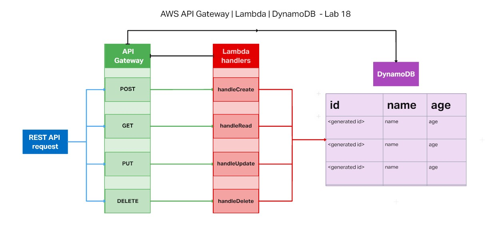
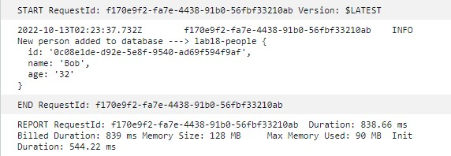
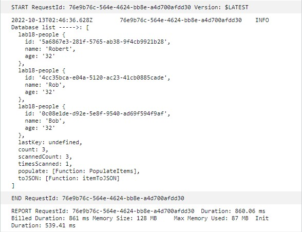
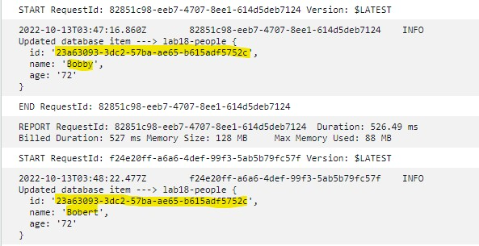
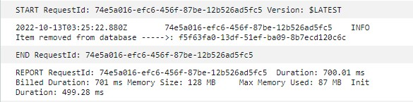

# AWS API Gateway | Lambda | DynamoDB

## Code 401d48 lab 18

## Author: Robert Ball

Lab Collaboration - coded along with in-class demo for handleCreate and handleRead for initial proof of life

**Live /people DynamoDB | [DynamoDB Link](https://lske4q71q5.execute-api.us-west-2.amazonaws.com/lab18/people)**

---

### Problem Domain

* Create a single resource REST API using a domain model of your choosing, constructed using AWS Cloud Services

---

### Requirements

Feature Tasks

* Create a DynamoDDB that can be updated using an AWS API Gateway that is linked to Lambda functions to handle REST API requests
  * establish a `/people` route that is able to handle the following requests:
    * Create
    * Read
    * Update
    * Delete

---

Documentation:

## API

* Available routes and methods:
  * `/people --> returns list of all items in DB`
  * `/people/<item id> --> route to view one item in DB`
  * `/people?id=<item id> --> route to update id`
  * `/people/<item id> --> route to delete item from DB`
  * `POST`
  * `GET`
  * `PUT`
  * `DELETE`

Application UML



Database `/people` schema:

```JSON
    {
    "id": "<chance generated string>",
    "name": "string",
    "age": "string"
    }
```

* CloudWatch log of creating DB item



* CloudWatch log of getting all DB items



* CloudWatch log of updating DB item



* CloudWatch log of deleting DB item



Dependencies:

```JSON
    {
    "dynamoose": "^3.1.0"
    }
```
